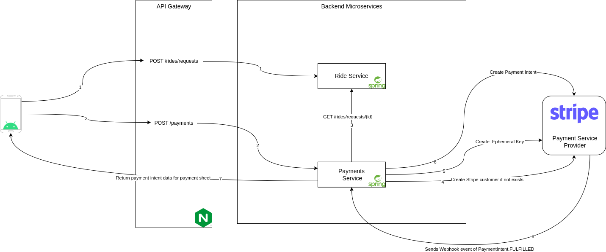

# Rideshare
This application is developed as part of Master's Project. This application provides ridesharing functionality to the user. The application has app developed in React Native which can be ran on Android and iOS. The application connects to various backend services throught Nginx acting as API Gateway. The application consistes of social media like feed where users can post Rides and Reviews for the rides that they took. Other users (riders) can request for the rides posted on the feed. If the driver accepts the request, rider is shown pickup point and has to pay for ride fare. Payment is handled by Stripe. This application demonstrates some of the best practices used for developing Enterprise Applications.   

## Use Case

## Class Diagram (Overall Entity Linkage)

## Architecture Diagram

## How To Run
* There are config files in each backend service folder (main/resources/application.properties) which you should edit with proper values. (To run in develop mode no need to edit any file)
* To run the backend just run `docker-compose up`
* For Frontend Mobile App, goto app folder and change Config.js to relavant values
* Run `npm start/ios/android/web` to run React Native App

## Backend Services
### Auth Service

* Authorization and Authentication of user
* Maintains data related to auth (username, password, role etc)
### User Info Service
* User information (Name, Age, etc, document info, profile) 
* Verifying Driver Licence
* Extract information from Licence
### Rides Service
* Ride information and management
* Route data
* Ride status information
### Posts Service
* Posts data 
  - Text
  - Image
  - Ride
  - Rating
  - Video
  - Multimedia support
### Ratings Service
* Avg Ratings of riders/drivers
* Ratings for each rides
### Payments Service

* Payments backend
* Order creating for rides
* Sending money to driver and company's share
* User's payment information
### Chat Service
* Chat backend code
* Save messages for chat between users
* Manages Web socket connections for chat
### Analytics Service
* Gather analytics information from all services
* APIs to access analytics for driver/rider/admin
